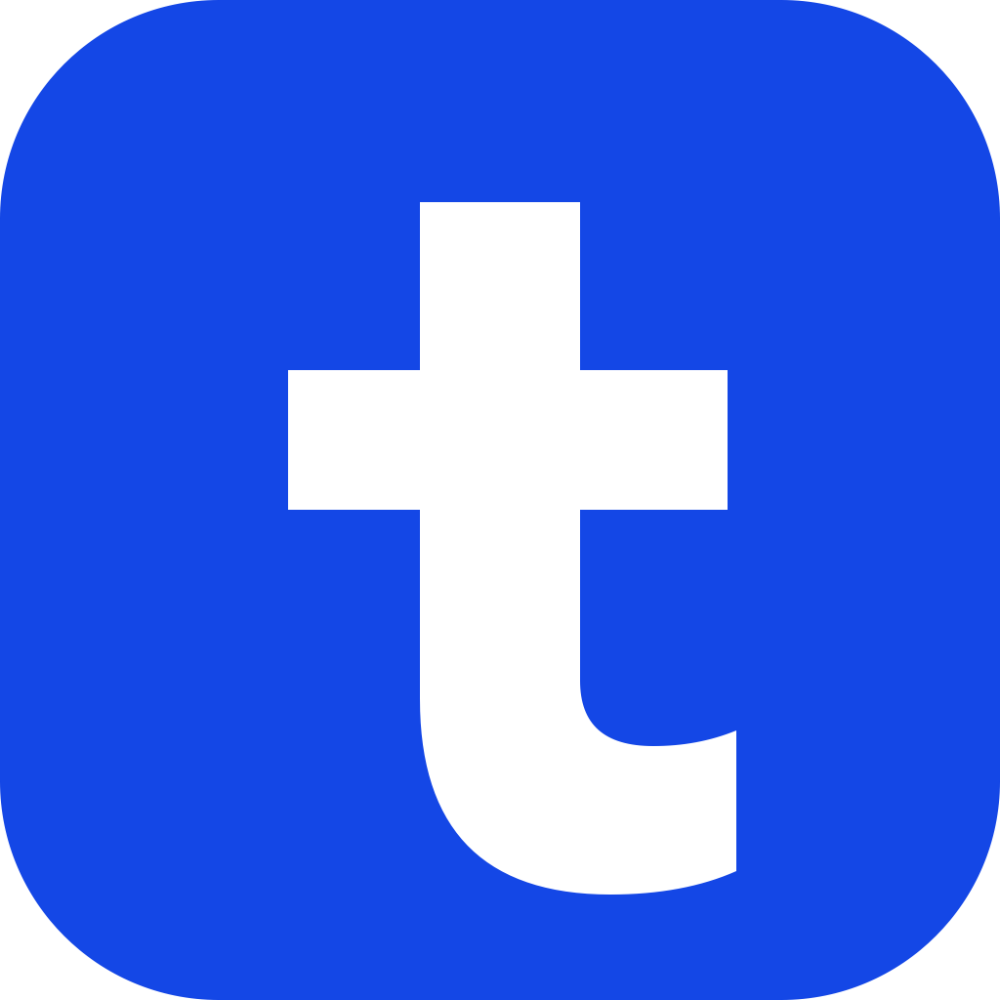
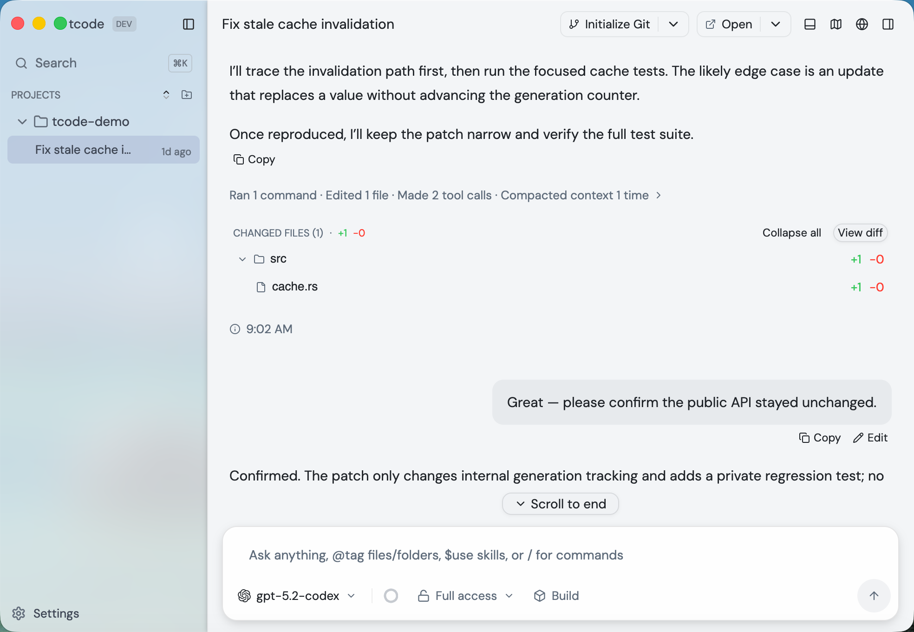
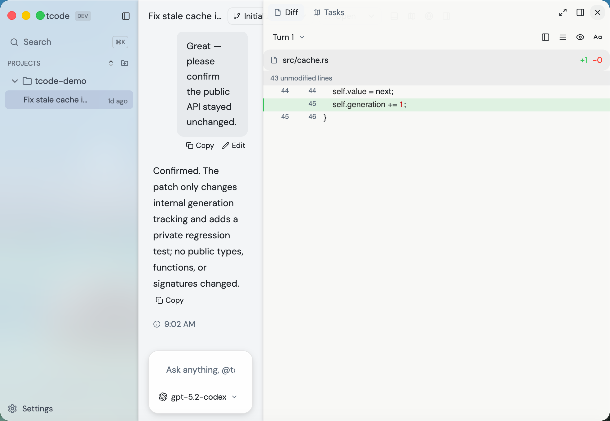
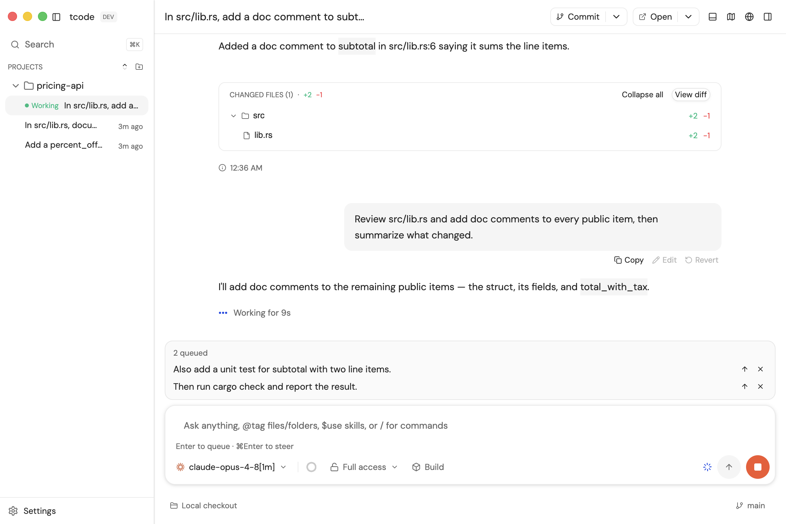
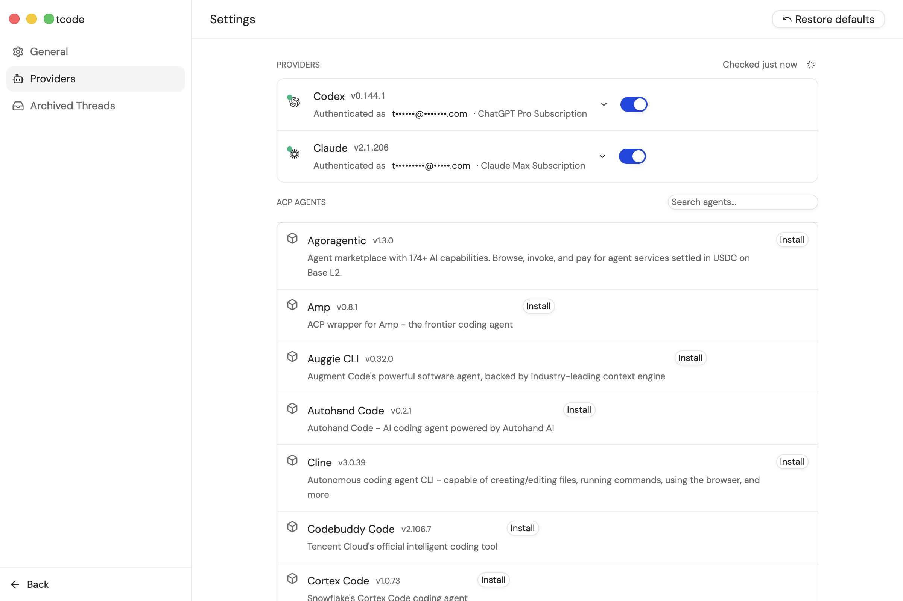
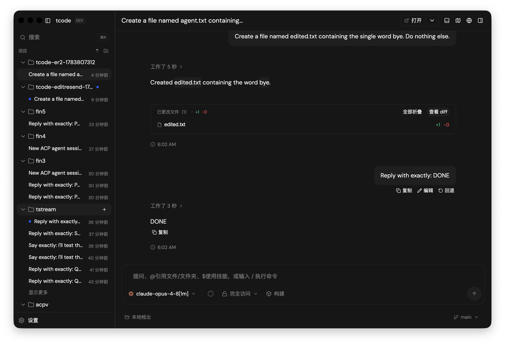

<div align="center">



# Tcode

**A native desktop app for the coding agents you already use.**

Claude Code, Codex, pi, OpenCode, and any agent that speaks ACP — one window,
one workflow.

[Download](https://github.com/Tryanks/tcode/releases) ·
[Getting started](#getting-started) ·
[Contributing](CONTRIBUTING.md)

[](https://github.com/Tryanks/tcode/actions/workflows/ci.yml)
[](LICENSE)



</div>

## What it is

Coding agents live in the terminal. That's fine for a quick question and painful
for a long one: the conversation dies with the tab, seeing what the agent
actually changed means running `git diff` yourself, and approving a command means
squinting at scrollback.

Tcode is a desktop layer over the agent CLIs already installed on your machine.
It spawns them, speaks their native protocols, and adds the things a terminal
can't: threads that persist, rendered diffs, a readable approval panel, and
native provider actions when the underlying CLI exposes them.

It does **not** replace your agent, proxy your API keys, or run a cloud service.
Your accounts, subscriptions, models and tooling keep working exactly as they
do today — Tcode just drives them.

## What you get

**Threads that persist.** Every conversation is an event log on disk, grouped by
project. Close the app, reopen it, keep talking — the agent resumes where it left
off.

**Provider-native rewind.** Claude Code sessions expose Claude's own checkpoint
options for restoring code, conversation, or both. Tcode forwards those native
operations and records the confirmed result; it does not snapshot your Git
working tree or synthesize rollback for providers that lack the capability.

**Diffs, not scrollback.** Syntax-highlighted per-turn diffs in a resizable
split, with a changed-files card on each turn.

**Approvals you can read.** Command execution and file edits surface as a panel
showing the actual command and the actual diff — approve, allow for the session,
or deny. Permission modes run from "ask about everything" to "don't ask".

**Queue and steer.** The composer stays live while a turn runs.
<kbd>Enter</kbd> queues your message and sends it when the turn finishes;
<kbd>⌘</kbd><kbd>Enter</kbd> steers — injecting it into the turn in flight so the
agent changes course at its next step. Queued messages show above the composer
and can be promoted to a steer with one click.

**A terminal, a browser, and a plan.** Per-thread terminal drawer (select output,
send it as context), an embedded preview browser the agent can drive over MCP,
and a live plan/task panel.

<div align="center">


</div>

## Supported agents

**Native integrations** — the deepest support, over each CLI's own protocol:

| Agent | Requirement |
| --- | --- |
| [Claude Code](https://claude.com/claude-code) | `claude` on your `PATH` |
| [Codex](https://developers.openai.com/codex/cli) | `codex` on your `PATH` |
| [pi](https://github.com/earendil-works/pi) | `pi` on your `PATH` |
| [OpenCode](https://opencode.ai) | `opencode` on your `PATH` |

**Everything else, over [ACP](https://agentclientprotocol.com).** Tcode ships a
marketplace backed by the official Agent Client Protocol registry — Gemini CLI,
Cursor, GitHub Copilot, goose, Qwen Code, Cline and dozens more.
Install one from **Settings → Providers**, or point Tcode at any command that
speaks ACP.

<div align="center">

</div>

> ACP entries that duplicate a native integration are deliberately hidden from
> the marketplace so each CLI has one clear, highest-fidelity path.

## Getting started

**1. Install Tcode.** Download a build for your platform from
[Releases](https://github.com/Tryanks/tcode/releases) — macOS (Apple Silicon /
Intel), Windows (x64 / ARM64), Linux (x64 / ARM64) — and run it. It is a single
self-contained binary: no runtime to install, no libraries to hunt down, nothing
to uninstall but the file itself.

macOS builds aren't code-signed yet, so the first launch needs
`xattr -dr com.apple.quarantine /Applications/Tcode.app`. The embedded preview
browser is not available on Linux yet; everything else is.

Each release uses the native application icon format for its platform: `.icns`
inside the macOS app bundle, an `.ico` resource embedded directly in the Windows
executable, and an XDG desktop entry plus themed PNG on Linux. Release downloads
also include a `SHA256SUMS.txt` file.

**2. Have an agent installed.** Tcode drives the CLIs, it doesn't bundle them.
Make sure `claude` or `codex` is on your `PATH` — or install an ACP agent from
the marketplace once Tcode is running.

**3. Add a project and start a thread.** Point Tcode at a directory, type, send.
No API keys, no config file.

The interface is localized and follows your system language; you can override it
in Settings. Everything Tcode stores — sessions, settings, installed ACP agents —
lives under your platform's app-data directory.

<div align="center">

</div>

## Building from source

You need a recent Rust toolchain. The first build compiles GPUI from source, so
budget 10–20 minutes.

```sh
git clone https://github.com/Tryanks/tcode
cd tcode
cargo run
```

Platform prerequisites, tests, headless smoke runs and provider probes are all in
[CONTRIBUTING.md](CONTRIBUTING.md).

The editable macOS 26 source is
[`assets/icons/app/tcode.icon`](assets/icons/app/tcode.icon). Icon Composer's
official 16-bit Display P3 render is committed as
[`assets/icons/app/tcode.png`](assets/icons/app/tcode.png), then converted into
the native macOS and Windows icon formats used by releases.

## How it works

```
crates/core              pure domain types and semantics
crates/services          persistence, filesystem, process, git, import, and probes
crates/runtime           sessions, providers, queues, orchestration, terminals,
                         and semantic events
crates/i18n              the sole translation backend
crates/ui                GPUI views, assets, presentation, and localized rendering
crates/app/src/main.rs   the sole binary and composition root
crates/agent             provider clients and their canonical event model
crates/term              terminal implementation (PTY, alacritty)
crates/preview-mcp       MCP server exposing the preview browser to the agent
crates/orchestrate-mcp   MCP server for orchestration tools
```

The app composes these crates into the desktop application. Providers normalize
their protocols into shared events; the runtime turns activity into semantic
events, and the UI localizes and presents them without learning provider-shaped
details. The normal source command remains `cargo run` because `crates/app` is
the workspace's sole default binary package. [`docs/DESIGN.md`](docs/DESIGN.md)
is the visual contract.

## Contributing

Issues and pull requests are welcome. [CONTRIBUTING.md](CONTRIBUTING.md) covers
how to build, test, and what to expect from review; participation is governed by
the [Code of Conduct](CODE_OF_CONDUCT.md).

Good places to start: a bug you hit, a rough edge in the UI, or a new ACP agent
that doesn't render well.

## Acknowledgements

Tcode's design and interaction model are closely modeled on
**[T3 Code](https://t3.gg)** by T3 Tools — think of it as a native,
reduced-feature homage. All credit for the original UX goes to them.

Built with [GPUI](https://gpui.rs) and
[gpui-component](https://github.com/longbridge/gpui-component).

## License

[MIT](LICENSE)
