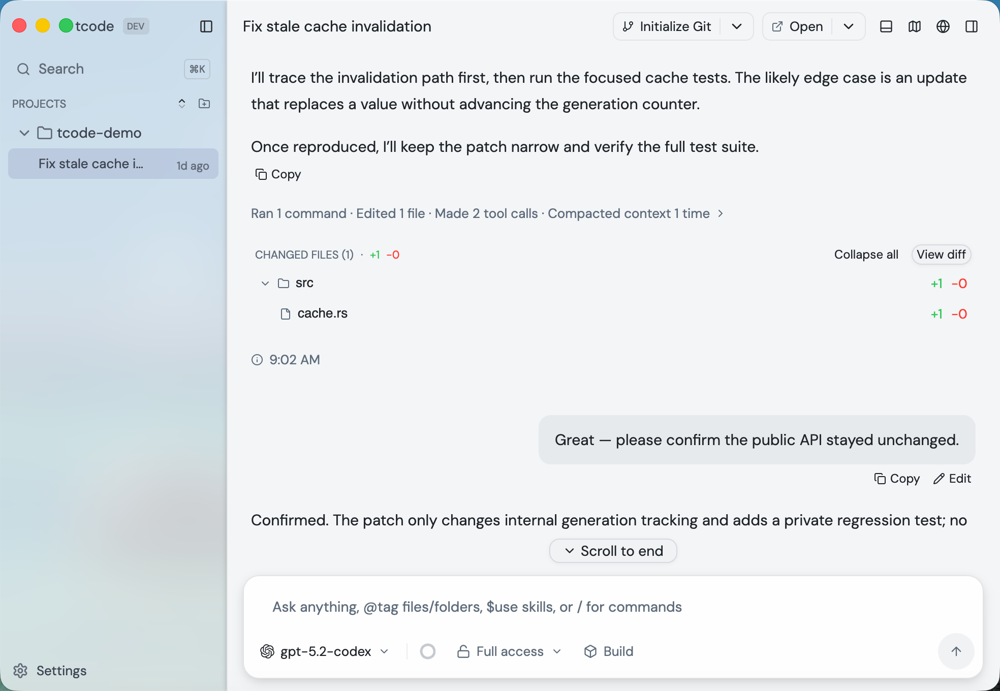
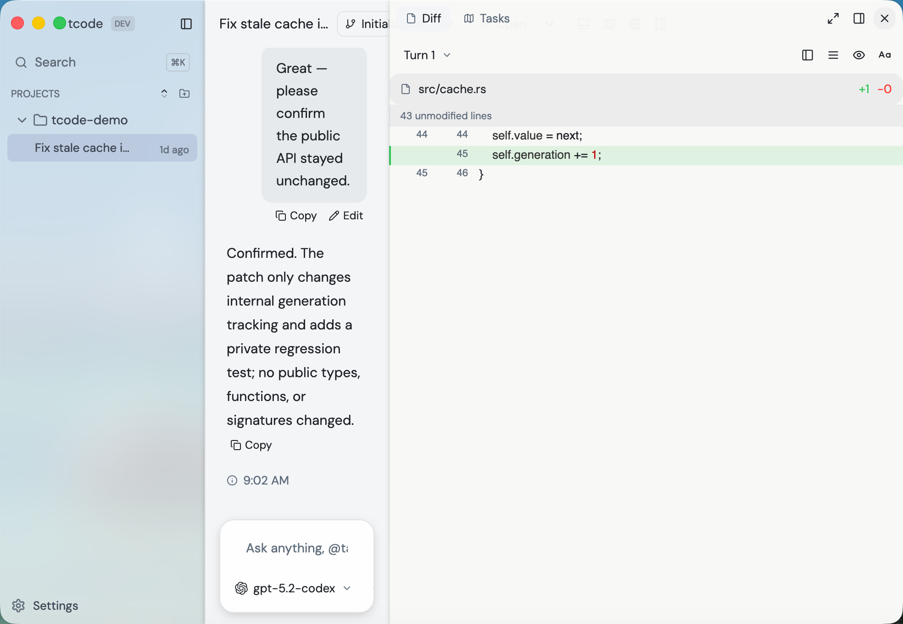
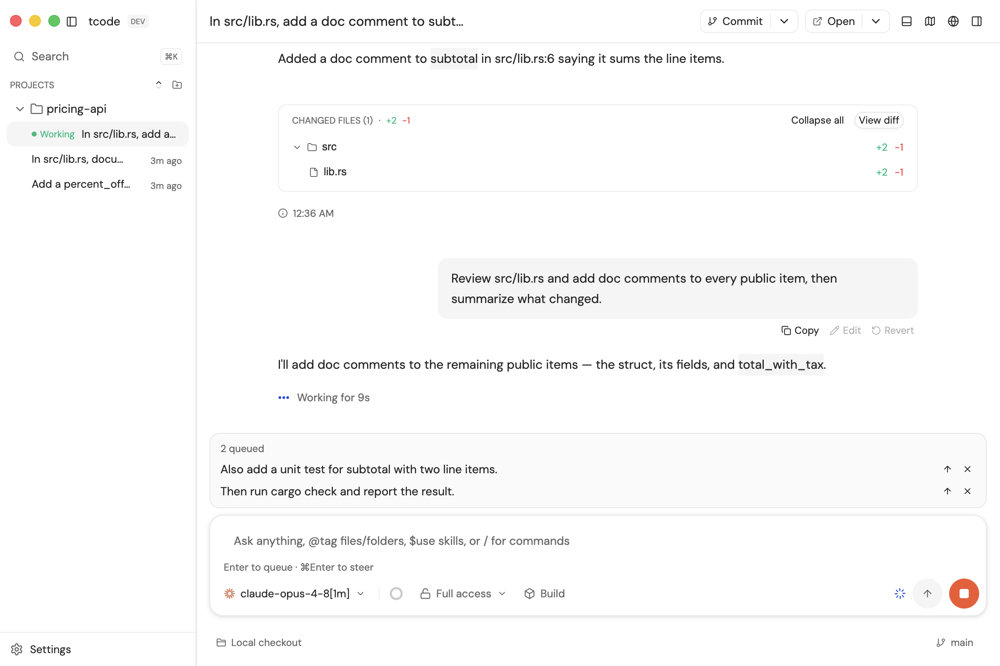
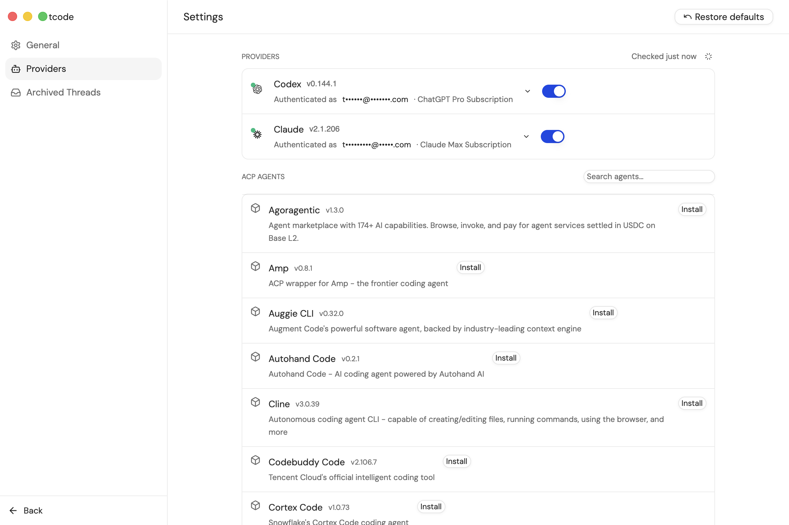
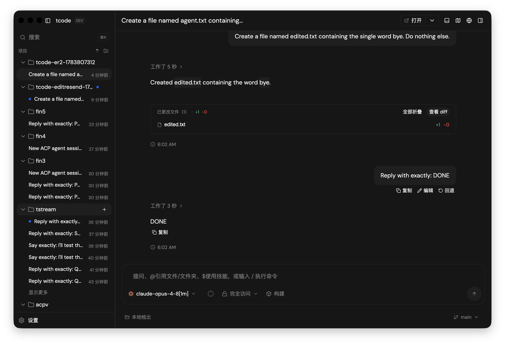

<div align="center">


# Tcode

**A native desktop app for the coding agents you already use.**

Claude Code, Codex, pi, OpenCode, and any agent that speaks ACP — one window,
one workflow.

[Download](https://github.com/Tryanks/tcode/releases) ·
[Getting started](#getting-started) ·
[Contributing](CONTRIBUTING.md)

[](https://github.com/Tryanks/tcode/actions/workflows/ci.yml)
[](LICENSE)



</div>

## What it is

Tcode is a desktop layer over the agent CLIs already installed on your machine.
It spawns them, speaks their native protocols, and provides persistent threads,
rendered diffs, a readable approval panel, and native provider actions when the
underlying CLI exposes them.

It does **not** replace your agent, proxy your API keys, or run a cloud service.
Your accounts, subscriptions, models and tooling keep working exactly as they
do today — Tcode just drives them.

## What you get

**Threads that persist.** Every conversation is an event log on disk, grouped by
project. Close the app, reopen it, keep talking — the agent resumes where it left
off.

**Provider-native rewind.** Claude Code sessions expose Claude's own checkpoint
options for restoring code, conversation, or both. Tcode forwards those native
operations and records the confirmed result; it does not snapshot your Git
working tree or synthesize rollback for providers that lack the capability.

**Diffs, not scrollback.** Syntax-highlighted per-turn diffs in a resizable
split, with a changed-files card on each turn.

**Approvals you can read.** Command execution and file edits surface as a panel
showing the actual command and the actual diff — approve, allow for the session,
or deny. Permission modes run from "ask about everything" to "don't ask".

**Queue and steer.** The composer stays live while a turn runs.
<kbd>Enter</kbd> queues your message and sends it when the turn finishes;
<kbd>⌘</kbd><kbd>Enter</kbd> on macOS or <kbd>Ctrl</kbd><kbd>Enter</kbd> on
Windows/Linux steers when the provider supports it, injecting the message into
the turn in flight. Providers without steering support queue it instead.
Queued messages show above the composer and offer a steer action where supported.

**A terminal, a browser, and a plan.** Per-thread terminal drawer (select output,
send it as context), an embedded preview browser the agent can drive over MCP,
and a live plan/task panel.

<div align="center">


</div>

## Supported agents

**Native integrations** — the deepest support, over each CLI's own protocol:

| Agent | Requirement |
| --- | --- |
| [Claude Code](https://claude.com/claude-code) | `claude` on your `PATH` |
| [Codex](https://developers.openai.com/codex/cli) | `codex` on your `PATH` |
| [pi](https://github.com/earendil-works/pi) | `pi` on your `PATH` |
| [OpenCode](https://opencode.ai) | `opencode` on your `PATH` |

**Everything else, over [ACP](https://agentclientprotocol.com).** Tcode ships a
marketplace backed by the official Agent Client Protocol registry.
Install one from **Settings → Providers**, or point Tcode at any command that
speaks ACP.

<div align="center">

</div>

> ACP entries that duplicate a native integration are deliberately hidden from
> the marketplace so each CLI has one clear, highest-fidelity path.

## Remote work mode

One tcode is the **host**: it runs the agents and keeps your projects and
threads. Any other tcode — another desktop, your phone, a browser tab — is a
screen for that host. Everything travels over your own LAN or overlay network
(Tailscale, EasyTier); there is no relay service.

**Host from the desktop.** Settings → Remote → **Host this computer**. Share the
pairing code or QR code with the device you want to connect. Codes are
single-use and expire after five minutes.

**Host from a server.** Download `tcode-headless` from
[Releases](https://github.com/Tryanks/tcode/releases), install your agent CLIs
on the server, then:

```sh
tcode-headless serve --listen 0.0.0.0:47420 --name build-server
tcode-headless pair      # prints a fresh pairing code and QR code
```

Release builds also serve the browser client at `https://<host>:47420/`.

**Connect a screen.** Desktop: Settings → Remote → pair by code or pick a nearby
host, then **Connect**. Phone: **Pair a host**, scan the QR code or enter the
address and code. Browser: open the host's HTTPS URL, verify its certificate in
the browser, and enter the code. See [pairing and certificate trust](docs/remote.md)
for the native and browser flows.

**Security.** Connections use TLS with a per-host self-signed certificate that
native clients pin at pairing. Pairing issues a device token you can revoke on
the host. QR codes carry the fingerprint; typing a code by hand trusts the first
certificate you reach, so compare fingerprints. Details, a systemd unit, and
troubleshooting: [docs/remote.md](docs/remote.md).

## Getting started

**1. Install Tcode.** Download a build for your platform from
[Releases](https://github.com/Tryanks/tcode/releases) — macOS (Apple Silicon /
Intel), Windows (x64 / ARM64), Linux (x64 / ARM64) — and run it. Check the release
notes for runtime requirements and signing status. Windows preview uses
WebView2; Linux needs the listed system libraries and a Vulkan driver.

For an unsigned macOS build, remove quarantine after installing the app with
`xattr -dr com.apple.quarantine /Applications/Tcode.app`. The embedded preview
browser is available on macOS and Windows; voice input requires macOS 26 or later.

Each release uses the native application icon format for its platform: `.icns`
inside the macOS app bundle, an `.ico` resource embedded directly in the Windows
executable, and an XDG desktop entry plus themed PNG on Linux. Release downloads
also include a `SHA256SUMS.txt` file.

| Platform / client | Release download |
| --- | --- |
| macOS, arm64 / x64 | Desktop `.zip` / `.dmg`; headless `.zip` |
| Windows, x64 / arm64 | Desktop or headless `.zip` |
| Linux, x64 / arm64 | Desktop or headless `.tar.gz` |
| Android, arm64 | `tcode-<version>-android-arm64-debug.apk` — debug build; install with adb |
| iOS, arm64 | `tcode-<version>-ios-arm64-unsigned.ipa` — unsigned debug build; re-sign before installing |
| Browser | Embedded in the headless release; open its HTTPS URL. No separate signed app package |

**2. Have an agent installed.** Tcode drives the CLIs, it doesn't bundle them.
Make sure `claude` or `codex` is on your `PATH` — or install an ACP agent from
the marketplace once Tcode is running.

**3. Add a project and start a thread.** Point Tcode at a directory, type, send.
No API keys, no config file.

The interface is localized and follows your system language; you can override it
in Settings. Everything Tcode stores — sessions, settings, installed ACP agents —
lives under your platform's app-data directory.

<div align="center">

</div>

## Building from source

Build instructions, platform prerequisites, workspace layout, tests and provider
probes are in [CONTRIBUTING.md](CONTRIBUTING.md).

The editable macOS 26 source is
[`assets/icons/app/tcode.icon`](assets/icons/app/tcode.icon). Icon Composer's
official 16-bit Display P3 render is committed as
[`assets/icons/app/tcode.png`](assets/icons/app/tcode.png), then converted into
the native macOS and Windows icon formats used by releases.

## Contributing

Issues and pull requests are welcome. [CONTRIBUTING.md](CONTRIBUTING.md) covers
how to build, test, and what to expect from review; participation is governed by
the [Code of Conduct](CODE_OF_CONDUCT.md).

Good places to start: a bug you hit, a rough edge in the UI, or a new ACP agent
that doesn't render well.

## Acknowledgements

Tcode's design and interaction model are closely modeled on
**[T3 Code](https://t3.gg)** by T3 Tools — think of it as a native,
reduced-feature homage. All credit for the original UX goes to them.

Built with [GPUI](https://gpui.rs) and
[gpui-kit](https://github.com/longbridge/gpui-kit).

## License

[MIT](LICENSE)
